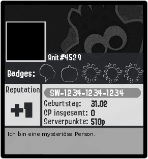

*******
Befehle
*******

Befehle eingeben
================

Befehle werden eingegeben, indem man ``w#befehl Argumente`` eingibt.

``[Argument-Typ]`` ist ein notwendiges Argument,
``<Argument-Typ>`` ein optionales.

Übersicht
=========

Nützliches
^^^^^^^^^^

.. csv-table::
    :widths: auto
    :align: left
    :header: "Befehl", "Beschreibung"

    "userinfo <User>", "Zeigt Informationen über einen User an."
    "serverinfo", "Zeigt Informationen über den Server an."
    "roleinfo [Rolle]", "Zeigt Informationen über eine Rolle an."
    "channelinfo [#Kanal]", "Zeigt Informationen über einen Kanal an."
    "emoteurl [Emoji]", "Zeigt die URL eines Custom-Emojis an, mit dem man das Emoji herunterladen kann."
    "avatar <User>", "Zeigt das Profilbild eines Users an."
    "color [Farbcode]", "Zeigt die Farbe an."
    "randomcolor", "Zeigt eine zufällige Farbe an."
    "ping", "Misst den Ping / die Latenz von Weemo."
    "poll [Frage] <noembed>", "Erstellt eine Umfrage."
    "`tag`_", "Speichern und ausfrufen von kurzen Texten."
    "random [a] [b]", "Würfelt eine Zahl, die zwischen a und b liegt.
        (Einschließlich a, aber ohne b)"
    "`remindme`_ [Zeitangabe] [Erinnerung]", "Erstellt eine Erinnerung."

Fun
^^^

.. csv-table::
    :widths: auto
    :align: left
    :header: "Befehl", "Beschreibung"

    "cookie <eat>", "Kekse |cookie|"
    "coinflip", "Wirft eine Münze."
    "rps", "Spiele *Schere, Stein, Papier*"
    "dog", "Sende ein Hundebild. |dog|"
    "cat", "Sende ein Katzenbild. |cat|"
    "`count`_", "Konfiguriert den Channel, in dem gezählt werden soll."
    "marry [@User]", "Stelle einen Heiratsantrag. |ring|"
    "divorce", "Lass dich scheiden. |broken_heart|"
    "meme", "Sende ein Meme."

Profil
^^^^^^

.. warning:: Daten, die über diese Befehle angegeben werden, sind öffentlich sichtbar.

.. csv-table::
    :widths: auto
    :align: left
    :header: "Befehl", "Beschreibung"

    "profile_", "Verwaltet und zeigt Profile."
    "rep [User]", "Schenke einem anderen User einen Reputationspunkt."
    "card_", "Verwaltet und zeigt Splatoon 2 Visitenkarten."
    "bday [Tag] [Monat]", "Trage deinen Geburtstag ein.
        Hinweise in bday_ beachten. [1]_"
    "fc [FC-Code]", "Speichert deinen Nintendo-Switch Freundescode ab. [1]_"
    "dreamcode [Traumcode]", "Speichert deinen ACNH Traum-Code ab. [1]_"
    "achievements", "Sendet eine DM mit deinen Weemo-Achievements."
    "cakeday", "Stelle ein, ob dir am Cakeday von Weemo gratuliert werden darf. [2]_"

.. [1] Diese Daten sind öffentlich sichtbar.
.. [2] Der Cakeday ist der Jahrestag der Erstellung deines Discord-Accounts.
    Den Tag bekommt Weemo von Discord mitgeteilt.

Konto
^^^^^

Das Weemo-Guthaben besteht aus zwei Geldbörsen: Dem Taschengeld und dem Bankkonto.
Wenn du Geld bekommst, wird dir dies als Taschengeld gegeben.
Du kannst es danach auf dein Konto einzahlen und von dort wieder abheben.

Geld auf der Bank kann nicht gestohlen und nicht an andere gegeben werden.

.. csv-table::
    :widths: auto
    :align: left
    :header: "Befehl", "Beschreibung", "Aliase"

    "daily", "Gibt dir dein tägliches Taschengeld."
    "weekly", "Gibt dir dein wöchentliches Taschengeld."
    "balance <User>", "Zeigt den Kontostand an.", "bal"
    "deposit [Menge | all]", "Zahl Taschengeld auf die Bank ein.", "dep"
    "withdraw [Menge | all]", "Hebt Geld von der Bank ab.", "draw"
    "pay [@User] [Menge]", "Bezahlt den Nutzer mit Taschengeld."
    "rob [@User]", "Stiehlt jemandem das Taschengeld."
    "shop_", "Benutze den Weemo-Shop."
    "job_", "Gehe gegen Bezahlung arbeiten."
    "inv", "Zeigt dein Inventar an."

Serverpunte
^^^^^^^^^^^

.. csv-table::
    :widths: auto
    :align: left
    :header: "Befehl", "Beschreibung", "Aliase"

    "rank <User>", "Zeigt die Rangübersicht an."
    "leveledroles_", "Richtet Levelrollen ein.", "lr"
    "top <Seite>", "Zeigt die Nutzer\*innen mit den meisten Serverpunkten an."
    "addpoints [Anzahl] [@User]", "Gibt einem User Serverpunkte."
    "removepoints [Anzahl] [@User]", "Entfernt einem User Serverpunkte."
    "resetpoints [@User | all]", "Entfernt alle Serverpunkte (des Users.)"
    "ignore_", "", "ignorechannel"
    "", ""

Details
=======

tag
^^^

Tags können genutzt werden, um kurze Textabschnitte zu speichern und schnell wieder aufzurufen.
Dies ist praktisch, falls auf eurem Server häufig die selbe Frage gestellt wird, und ihr nicht jedes mal einen neuen
Antworttext schreiben wollt.

.. csv-table::
    :widths: auto
    :align: left
    :header: "Befehl", "Beschreibung"

    "tag", "Listet alle Tags für diesen Server auf"
    "tag [Tag] <@User>", "Ruft den Tag auf und pingt auch bei einem erwähnten Mitglied."
    "tag create [Tag] [Nachricht]", "Erstellt einen neuen Tag mit dem Namen und der hinterlassenden Nachricht."
    "tag edit [Tag] [Nachricht]", "Editiert einen Tag."
    "tag info [Tag]", "Ruft Informationen über den Tag ab."
    "tag rename [Tag] [Neuer |nbsp| Tagname]", "Benennt den angegebenen Tag um."
    "tag delete [Tag]", "Löscht einen Tag aus der Liste."

remindme
^^^^^^^^

Erstellt Erinnerungen. Es ist nur eine Erinnerung zeitgleich pro Account möglich.

.. csv-table::
    :widths: auto
    :align: left
    :header: "Befehl", "Beschreibung"

    "remindme [Zeitangabe] [Erinnerung]", "Startet eine neue Erinnerung."
    "remindme remove", "Stoppt die aktuelle Erinnerung."

**Beispiel**: ``w#remindme 30m Müll rausbringen``

**Zeitangaben**:

.. csv-table::
    :widths: auto
    :align: left

    "``s``", "Sekunden"
    "``m``", "Minuten"
    "``d``", "Tage"
    "``mo``", "Monate"

count
^^^^^

.. csv-table::
    :widths: auto
    :align: left
    :header: "Befehl", "Beschreibung"

    "count setchannel [#Textkanal]", "Konfiguriert den Textkanal, in dem gezählt werden soll. Sollte der Textkanal nicht das erste mal eingerichtet werden sondern gewechselt, wird der Zähler auf 1 zurückgesetzt."
    "count removechannel", "Entfernt den Textkanal wieder."

bday
^^^^

Mit ``bday [Tag] [Monat]`` kann der Geburtstag eingetragen werden.
Das Geburtsjahr wird nicht gespeichert.
Dein Geburtstag (ohne Jahr) ist öffentlich in deinem Profil sichtbar und wird von Weemo für Geburtstagsaktionen verwendet.

.. warning:: Der Geburtstag ist öffentlich sichtbar.

.. warning:: Der Geburtstag kann nach dem ersten Eintragen nicht geändert und nur über den Weemo-Support gelöscht werden.

profile
^^^^^^^

Das Profil kann auf zwei Arten dargestellt werden. Als Embed oder als Bild.
Die Einstellung dafür wird von jedem Nutzer für sein oder ihr Profil selbst getroffen.

Das Embed sieht so aus:

.. image:: images/profile_embed_example.png
    :alt: Das Profil in Embedform.

und das Bild so:

**Befehle**:

E = Funktioniert in Embedform, B = Funktioniert in Bildform.

.. csv-table::
    :widths: auto
    :align: left
    :header: "Befehl", "Beschreibung", "E", "B"

    "profile [@User]", "Ruft das Profil des gepingtem Mitglied auf.", "|tick|", "|tick|"
    "profile desc [Deine Beschreibung]", "Aktualisiert deine Beschreibung.", "|tick|", "[3]_"
    "profile bg [Hintergrund]", "Setzt den Hintergrund deines Profils.", "", "|tick|"
    "profile banner [URL]", "Setzt den Banner deines Profils.", "|tick|", ""
    "profile social", "Verlinke deine Socialmedia-Accounts.", "|tick|", "|tick|"
    "profile badge [Badge]", "Zeigt Informationen über das Badge an.", "|tick|", "|tick|"
    "profile settings", "Verwalte dein Profil.", "|tick|", "|tick|"

.. [3] Wird möglicherweise gekürzt angezeigt.

**Hintergründe**:

Aktuell gibt es die Hintergründe ``default``, ``octo``, ``octo2`` und ``octo3``.

**Einstellungen**:

- Typ der Karte.

    Es gibt ``embed`` für die Embed-Form und ``image`` für die Bildform.

    Syntax: ``w#profile settings type [embed | image]``

card
^^^^

Die Card ist die Splatoon 2 - Visitenkarte mit allen wesentlichen Informationen.

.. image:: images/card_example.png
    :alt: Eine Weemo-Beispiel-Karte. Es sind folgende Daten angegeben. Discord-Nutzername, Level, Charakter, Freundescode und Ränge in Herschafft, Muschelchaos, Goldfischkanone, Turmkommando und Salmon Run.

**Befehle**:

.. csv-table::
    :widths: auto
    :align: left
    :header: "Befehl", "Beschreibung", "E", "B"

    "card [@User]", "Ruft die Rangkarte des gepingtem Mitglied auf."
    "card level [Dein Level]", "Aktualisiert dein Level auf den angegebenden Wert."
    "card char [Inkling / Oktoling]", "Aktualisiert deinen Charakter in der Rangkarte."
    "card rank [SZ, RM, TC, CB, SALMON] [Dein Rang]", "Aktualisiert deinen Rang im angegebendem Modus."
    "card power [SZ, RM, TC, CB] [Power]", "Setzt deine Power im angegebendem Modus."
    "card bg", "Konfiguriert den Hintergrund der Card."
    "fc [Freundescode]", "Setzt oder Aktualisiert deinen Freundescode."

**Erklärung der Modi**:

.. csv-table::
    :widths: auto
    :align: left
    :header: "Kürzel", "Modus", "Ursprung"

    "SZ", "Herrschaft", "Splat Zones"
    "RM", "Operation Goldfischkanone", "Rain Maker"
    "TC", "Turm Kommando", "Tower Control"
    "CB", "Muschelchaos", "Clam Blitz"
    "SALMON", "Salmon Run", "Salmon Run"

shop
^^^^

.. csv-table::
    :widths: auto
    :align: left
    :header: "Befehl", "Beschreibung"

    "shop <Seitenzahl>", "Zeigt die Auswahl im Shop an.",
    "shop [Item]", "Kaufe ein Item im Shop.",
    "shop cookie [Anzahl]", "Kaufe Kekse."
    "shop show [Item]", "Zeige eine Vorschau für den Hintergrund."
    "shop settings pay [CP | Bank]", "Stelle ein, ob du mit Taschengeld (CP) oder vom Bankkonto bezahlen möchtest."

job
^^^

Der *Job* ist ein Zeitspiel.
Suche dir einen der Jobs aus und komm dann nach der angegeben Zeit wieder, um dein Taschengeld mitzunehmen.
Wenn du zu spät kommst gibt es kein Gehalt.
Du kannst nur einen Job pro Tag machen.
Für einige Jobs benötigst du ein Item aus dem Shop_.

.. csv-table::
    :widths: auto
    :align: left
    :header: "Befehl", "Beschreibung"

    "job", "Zeige verfügbare Jobs an."
    "job [Zahl]", "Starte einen Job."
    "job", "Hole dir dein Gehalt ab."

leveledroles
^^^^^^^^^^^^

.. csv-table::
    :widths: auto
    :align: left
    :header: "Befehl", "Beschreibung"

    "leveledroles add [@Rolle] [Serverpunkte]", "Fügt eine neue Levelrolle hinzu."
    "leveledroles remove [@Rolle]", "Entfernt die Levelrolle."
    "leveledroles setmessage [Nachricht]", "Stellt die benutzerdefinierte Levelrollennachricht ein."
    "leveledroles message", "Zeigt die benutzerdefinierte Levelrollennachricht."
    "leveledroles list", "Listet die Levelrollen für den Server auf."
    "leveledroles setchannel [#Channel]", "Konfiguriert den Levelup-Nachrichtenkanal."
    "leveledroles removechannel", "Entfernt den Levelup-Nachrichtenkanal, sofern er existiert."

Platzhalter für Nachrichtentext:

.. csv-table::
    :widths: auto
    :align: left
    :header: "Platzhalter", "Beschreibung"

    "``%user%``", "Nutzer"
    "``%role%``", "Rolle"

ignore
^^^^^^

Alias: ``ignorechannel``

.. csv-table::
    :widths: auto
    :align: left
    :header: "Befehl", "Beschreibung"

    "ignore add [#Textkanal]", "Fügt den Channel hinzu, in dem keine Serverpunkte gesammelt werden sollen."
    "ignore remove [#Textkanal]", "Entfernt den Channel eben wieder. Serverpunkte werden dann aber wieder gesammelt."
    "ignore list", "Listet alle Channel auf, in denen keine Serverpunkte gesammelt werden sollen."

.. |cookie| unicode:: 0x1f36a .. Keks Emoji
.. |cat| unicode:: 0x1f431 .. Katzen Emoji
.. |dog| unicode:: 0x1f436 .. Hunde Emoji
.. |coin| unicode:: 0x1fa99 .. Münze Emoji
.. |ring| unicode:: 0x1f48d .. Ehering Emoji
.. |broken_heart| unicode:: 0x1f494 .. Gebrochenes Herz Emoji
.. |tick| unicode:: 0x2713 .. Check Mark
.. |nbsp| unicode:: 0xA0 .. Non breaking Space
   :trim:
