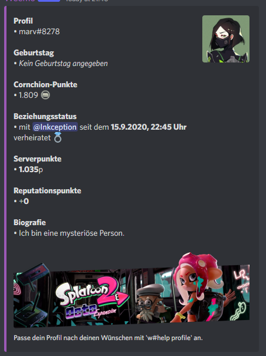
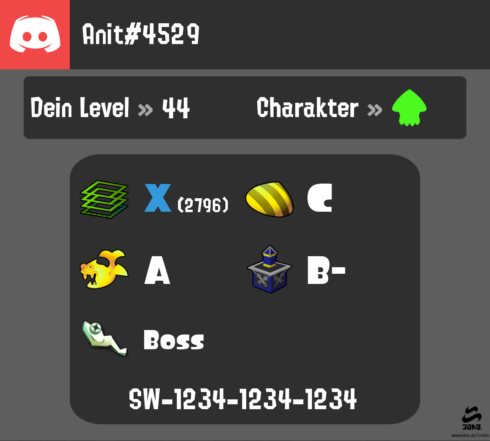
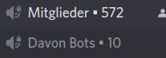
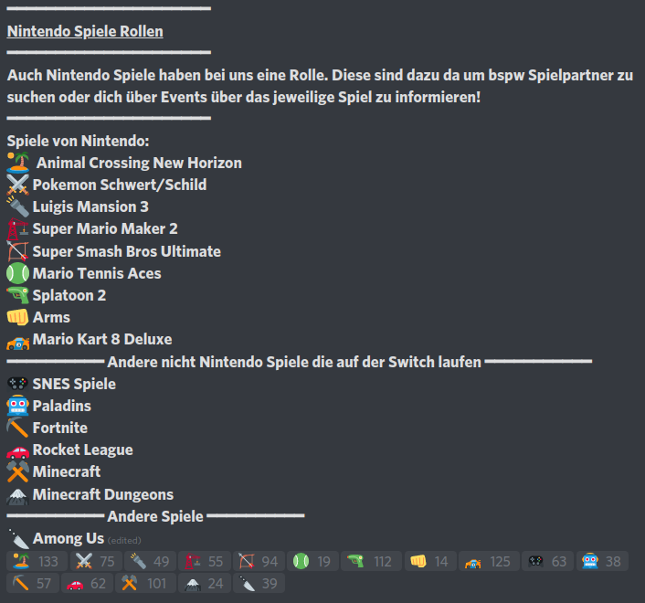

*******
Befehle
*******

Befehle eingeben
================

Befehle werden eingegeben, indem man ``w#befehl Argumente`` eingibt.  
Der Prefix wird in der Anleitung jedoch nie mitgeschrieben, um es übersichtlicher zu halten.
Zudem kann der Prefix auf eurem Server ein anderer als ``w#`` sein.

In dieser Anleitung werden die Argument-Typen in Klammern dargestellt, damit man erkennt, dass es ein Argument ist.  
Die Klammern dürfen nicht mitgeschrieben werden.

Wenn in der Anleitung also ``emoteurl [Emoji]`` steht, dann muss auf Discord "w#emoteurl |cat|" eingegeben werden.

``[Argument-Typ]`` ist ein notwendiges Argument,
``<Argument-Typ>`` ein optionales.

Übersicht
=========

Nützliches
^^^^^^^^^^

.. csv-table::
    :widths: auto
    :align: left
    :header: "Befehl", "Beschreibung"

    "userinfo <User>", "Zeigt Informationen über einen User an."
    "serverinfo", "Zeigt Informationen über den Server an."
    "servericon", "Betrachte das Serverbild in voller Pracht."
    "roleinfo [Rolle]", "Zeigt Informationen über eine Rolle an."
    "channelinfo [#Kanal]", "Zeigt Informationen über einen Kanal an."
    "emoteurl [Emoji]", "Zeigt die URL eines Custom-Emojis an, mit dem man das Emoji herunterladen kann."
    "avatar <User>", "Zeigt das Profilbild eines Users an."
    "color [Farbcode]", "Zeigt die Farbe an."
    "randomcolor", "Zeigt eine zufällige Farbe an."
    "ping", "Misst den Ping / die Latenz von Weemo."
    "poll [Frage] <noembed>", "Erstellt eine Umfrage."
    "`tag`_", "Speichern und aufrufen von kurzen Texten."
    "random [a] [b]", "Würfelt eine Zahl, die zwischen a und b liegt.
        (Einschließlich a, aber ohne b)"
    "`remindme`_ [Zeitangabe] [Erinnerung]", "Erstellt eine Erinnerung."

Fun
^^^

.. csv-table::
    :widths: auto
    :align: left
    :header: "Befehl", "Beschreibung"

    "cookie <eat>", "Kekse |cookie|"
    "coinflip", "Wirft eine Münze."
    "rps", "Spiele *Schere, Stein, Papier*"
    "dog", "Sende ein Hundebild. |dog|"
    "cat", "Sende ein Katzenbild. |cat|"
    "`count`_", "Konfiguriert den Channel, in dem gezählt werden soll."
    ":ref:`quiz<emojiquiz_befehle>`", "Informationen über das :ref:`Emojiquiz<emojiquiz>`."
    "`guessthenumber`_", "Könnt ihr die richtige Nummer erraten? Informationen über `guessthenumber`_."
    "ship [@User1] [@User2]", "Shippe zwei Mitglieder. |kiss|"

Profil
^^^^^^

.. warning:: Daten, die über diese Befehle angegeben werden, sind öffentlich sichtbar.

.. csv-table::
    :widths: auto
    :align: left
    :header: "Befehl", "Beschreibung"

    "profile_", "Verwaltet und zeigt Profile."
    "rep [User]", "Schenke einem anderen User einen Reputationspunkt."
    "card_", "Verwaltet und zeigt Splatoon 2 Visitenkarten."
    "bday [Tag] [Monat]", "Trage deinen Geburtstag ein.
        Hinweise in bday_ beachten. [1]_"
    "fc [FC-Code]", "Speichert deinen Nintendo-Switch Freundescode ab. [1]_"
    "achievements", "Sendet eine DM mit deinen Weemo-Achievements."
    "cakeday", "Stelle ein, ob dir am Cakeday von Weemo gratuliert werden darf. [2]_"
    "marry [@User]", "Stelle einen Heiratsantrag. |ring|"
    "divorce", "Lass dich scheiden. |broken_heart|"

.. [1] Diese Daten sind öffentlich sichtbar.
.. [2] Der Cakeday ist der Jahrestag der Erstellung deines Discord-Accounts.
    Den Tag bekommt Weemo von Discord mitgeteilt.

Konto
^^^^^

Das Weemo-Guthaben besteht aus zwei Geldbörsen: Dem Taschengeld und dem Bankkonto.
Wenn du Geld bekommst, wird dir dies als Taschengeld gegeben.
Du kannst es danach auf dein Konto einzahlen und von dort wieder abheben.

Geld auf der Bank kann nicht gestohlen und nicht an andere gegeben werden.

.. csv-table::
    :widths: auto
    :align: left
    :header: "Befehl", "Beschreibung", "Aliase"

    "daily", "Gibt dir dein tägliches Taschengeld."
    "weekly", "Gibt dir dein wöchentliches Taschengeld."
    "balance <User>", "Zeigt den Kontostand an.", "bal"
    "deposit [Menge |nbsp| | |nbsp| all]", "Zahl Taschengeld auf die Bank ein.", "dep"
    "withdraw [Menge |nbsp| | |nbsp| all]", "Hebt Geld von der Bank ab.", "draw"
    "pay [@User] [Menge]", "Bezahlt den Nutzer mit Taschengeld."
    "rob_ [@User]", "Stiehlt jemandem das Taschengeld."
    "shop_", "Benutze den Weemo-Shop."
    "job_", "Gehe gegen Bezahlung arbeiten."
    "inv", "Zeigt dein Inventar an."

Serverpunte
^^^^^^^^^^^

.. csv-table::
    :widths: auto
    :align: left
    :header: "Befehl", "Beschreibung", "Aliase"

    "rank_ <User>", "Zeigt die Rangübersicht an."
    "leveledroles_", "Richtet Levelrollen ein.", "lr"
    "top <Seite>", "Zeigt die Nutzer\*innen mit den meisten Serverpunkten an."
    "addpoints [Anzahl] [@User]", "Gibt einem User Serverpunkte."
    "removepoints [Anzahl] [@User]", "Entfernt einem User Serverpunkte."
    "resetpoints [@User |nbsp| | |nbsp| all]", "Entfernt alle Serverpunkte (des Users.)"
    "ignore_", "Kanäle für die Punktevergabe ignorieren.", "ignorechannel"
    "persistence_", "Cooldown und Anzahl der Serverpunkte einstellen."

Moderation
^^^^^^^^^^

Eine detailierte Beschreibung kann im Abschnitt :ref:`Moderation<moderation>` gefunden werden.

.. csv-table::
    :widths: auto
    :align: left
    :header: "Befehl", "Beschreibung", "Aliase"

    ":ref:`ban<moderation_ban>` [@Mitglied] [Grund]", "Bannt ein Mitglied."
    ":ref:`idban<moderation_idban>` [:ref:`ID<id>`] [Grund]", "Bannt ein Mitglied über die :ref:`ID<id>`."
    ":ref:`tempban<moderation_tempban>` [@Mitglied] [Dauer] [Grund]", "Bannt ein Mitglied zeitweise vom Server."
    ":ref:`unban<moderation_unban>` [UserID]", "Entbannt eine gebannte Person."
    ":ref:`mute<moderation_mute>` [@Mitglied] [Dauer] <Grund>", "Muted ein Mitglied."
    ":ref:`unmute<moderation_unmute>` [@Mitglied]", "Entmuted ein Mitglied."
    ":ref:`kick<moderation_kick>` [@Mitglied] [Grund]", "Kickt ein Mitglied.", "raus"
    ":ref:`warn<moderation_warn>` [@Mitglied] [Grund]", "Verwarnt ein Mitglied."
    ":ref:`purge<moderation_purge>` [Zahl]", "Löscht die letzten x Nachrichten.", "cc, clear"
    ":ref:`punishments<moderation_punishments>` <@Mitglied>", "Zeigt Verwarnungen des Mitglieds an."

Serververwaltung
^^^^^^^^^^^^^^^^

.. csv-table::
    :widths: auto
    :align: left
    :header: "Befehl", "Beschreibung", "Aliase"

    ":ref:`modlog<modlog>`", "Verwaltet das Modlog."
    ":ref:`joinmsg<joinmsg_leavemsg>`", "Richtet die Join-Nachricht ein."
    ":ref:`leavemsg<joinmsg_leavemsg>`", "Richtet die Leave-Nachricht ein."
    "joinrole_", "Richtet die Join-Rolle ein."
    "modrole", "Richtet die Mod-Rolle ein."
    "slowdown [Zeit |nbsp| in |nbsp| s]", "Fügt einen Slowmode zu dem Kanal."
    "mcount_", "Verwaltung der Mitgliedszähleranzeige."
    ":ref:`automod<automod>`", "Verwaltung des Automod."
    "reactionroles_", "Verwaltung der Reaktionsrollen", "rr"
    "prefix [prefix]", "Ändert Weemos Prefix."
    "roleemote add [Name] [@Rolle]", "Fügt ein neues Emote hinzu, welches nur mit einer bestimmten Rolle sichtbar ist."
    "rob_ toggle", "De-/Aktiviert das Ausrauben von anderen Mitgliedern"

Musik
^^^^^

.. csv-table::
    :widths: auto
    :align: left
    :header: "Befehl", "Beschreibung", "Aliase", ""

    "play_ [Lied]", "Fügt einen Song zur Warteschlange hinzu.", "p"
    "queue_", "Zeigt die Warteschlange an.", "q"
    "pause", "Pausiert oder spielt die Musik weiter ab.", "resume", "[3]_"
    "skip", "Überspringt das aktuelle Lied.", "s", "[3]_"
    "volume [1-100]", "Stellt die Lautstärke ein.", "vol", "[3]_"
    "stop", "Weemo verlässt den Sprachkanal.", "", "[3]_"
    "stick", "Heftet Weemo an den Kanal fest.", ""
    "loop", "Wiedholt das einzelne Lied oder die Warteschlange.", "", "[3]_"
    "lyrics <Lied>", "Sucht die Lyrics des aktuellen oder angegeben Liedes.", ""
    "bassboost_ [modi]", "Ein wenig mehr Bass gefällig?", "", "[3]_"
    "radio_ [Sender]", "Spielt einen Radiosender ab.", ""

.. [3] Benötigt eine Rolle mit dem Namen "DJ", wenn mehr als 2 Mitglieder im Voicechannel sind.

.. _befehle_private_sprachkanaele:

Private Kanäle
^^^^^^^^^^^^^^^^^^^^

.. csv-table::
    :widths: auto
    :align: left
    :header: "Befehl", "Beschreibung"

    "room_", "Ruft das Menü für private Sprachkanäle auf."
    "forcedel [@User]", "Löscht den Sprachkanal aus Weemos Datenbank. Siehe auch :ref:`FAQ<forcedel>`."
    "setcategory [:ref:`Kategorie-ID<id>`]", "Legt die Kategorie für die Kanäle fest."

Anime
^^^^^

.. csv-table::
    :widths: auto
    :align: left
    :header: "Befehl", "Beschreibung"

    "hug [@User]", "Umarme ein Mitglied."
    "cry", "Weine und lass es alles einfach mal raus."
    "cuddle [@User]", "Knuddel ein Mitglied."
    "pat [@User]", "Kraule ein Mitglied."
    "tickle [@User]", "Kitzel ein Mitglied."
    "stare <@User>", "Beobachte wen. Unheimlich"
    "kiss [@User]", "Küsse ein Mitglied."
    "slap [@User]", "Schlage ein Mitglied. Autsch."
    "neko", "Zeigt dein Neko."
    "owoify [Nachricht]", "Owoifyt die NYachwicht."

Bildgeneration
^^^^^^^^^^^^^^

.. note:: Die Befehle der Bildgeneration sind wegen eines Fehlers in der API zeitweise deaktiviert.

Spielstatistiken
^^^^^^^^^^^^^^^^

.. csv-table::
    :widths: auto
    :align: left
    :header: "Befehl", "Beschreibung"

    "osustats [OSU-Name] <--modusname>", "Zeigt Statistiken über das OSU-Profil."

Streamankündigungen
^^^^^^^^^^^^^^^^^^^

.. csv-table::
    :widths: auto
    :align: left
    :header: "Befehl", "Beschreibung"

    "streamalert_", "Verwaltet Streamankündigungen."

Weemo
^^^^^

.. csv-table::
    :widths: auto
    :align: left
    :header: "Befehl", "Beschreibung"

    "help <Seite>", "Listet alle Befehle auf."
    "help [Befehl]", "Zeigt weitere Informationen zu einem Befehl an."
    "about", "Live-Informationen über mich."
    "setup_", "Ich richte dir den Kram für deinen Server ein."
    "vote", "Links, um für mich zu voten und mich damit zu unterstützen."
    "invite", "Der Link, um mich einzuladen."

Details
=======

tag
^^^

Tags können genutzt werden, um kurze Textabschnitte zu speichern und schnell wieder aufzurufen.
Dies ist praktisch, falls auf eurem Server häufig die selbe Frage gestellt wird, und ihr nicht jedes mal einen neuen
Antworttext schreiben wollt.

.. csv-table::
    :widths: auto
    :align: left
    :header: "Befehl", "Beschreibung"

    "tag", "Listet alle Tags für diesen Server auf"
    "tag [Tag] <@User>", "Ruft den Tag auf und pingt auch bei einem erwähnten Mitglied."
    "tag create [Tag] [Nachricht]", "Erstellt einen neuen Tag mit dem Namen und der hinterlassenden Nachricht."
    "tag edit [Tag] [Nachricht]", "Editiert einen Tag."
    "tag info [Tag]", "Ruft Informationen über den Tag ab."
    "tag rename [Tag] [Neuer |nbsp| Tagname]", "Benennt den angegebenen Tag um."
    "tag delete [Tag]", "Löscht einen Tag aus der Liste."

remindme
^^^^^^^^

Erstellt Erinnerungen. Es ist nur eine Erinnerung zeitgleich pro Account möglich.

.. csv-table::
    :widths: auto
    :align: left
    :header: "Befehl", "Beschreibung"

    "remindme [Zeitangabe] [Erinnerung]", "Startet eine neue Erinnerung."
    "remindme remove", "Stoppt die aktuelle Erinnerung."

**Beispiel**: ``w#remindme 30m Müll rausbringen``

**Zeitangaben**:

.. csv-table::
    :widths: auto
    :align: left

    "``s``", "Sekunden"
    "``m``", "Minuten"
    "``d``", "Tage"
    "``mo``", "Monate"

count
^^^^^

.. csv-table::
    :widths: auto
    :align: left
    :header: "Befehl", "Beschreibung"

    "count setchannel [#Textkanal]", "Konfiguriert den Textkanal, in dem gezählt werden soll. Sollte der Textkanal nicht das erste mal eingerichtet werden sondern gewechselt, wird der Zähler auf 1 zurückgesetzt."
    "count removechannel", "Entfernt den Textkanal wieder."
    "count nofail", "(De)Aktiviert den NoFail-Modus, welcher bei einer falschen Zahl auf 1 zurücksetzt."

guessthenumber
^^^^^^^^^^^^^^

Spielprinzip:
Ich suche eine zufällige Zahl aus. Du musst versuchen, diese Zahl zu erraten.
Gelingt dir das, erhältst du einen Punkt und eine weitere Runde beginnt.

.. csv-table::
    :widths: auto
    :align: left
    :header: "Befehl", "Beschreibung"

    "guessthenumber top", "Zeigt eine globale Top 10-Bestenliste der User, die die meisten Zahlen erraten haben."
    "guessthenumber setchannel [#Textkanal]", "Konfiguriert den Textkanal, in dem GuessTheNumber gespielt werden soll."
    "guessthenumber reset", "Entfernt den Textkanal, in dem GuessTheNumber gespielt werden soll."

bday
^^^^

Mit ``bday [Tag] [Monat]`` kann der Geburtstag eingetragen werden.
Das Geburtsjahr wird nicht gespeichert.
Dein Geburtstag (ohne Jahr) ist öffentlich in deinem Profil sichtbar und wird von Weemo für Geburtstagsaktionen verwendet.

.. warning:: Der Geburtstag ist öffentlich sichtbar.

.. warning:: Der Geburtstag kann nach dem ersten Eintragen nicht geändert und nur über den Weemo-Support gelöscht werden.

.. _befehle_profile:

profile
^^^^^^^

Das Profil sieht so aus:

**Befehle**:

.. csv-table::
    :widths: auto
    :align: left
    :header: "Befehl", "Beschreibung"

    "profile [@User]", "Ruft das Profil des gepingtem Mitglied auf."
    "profile desc [Deine |nbsp| Beschreibung]", "Aktualisiert deine Beschreibung."
    "profile banner [URL]", "Setzt den Banner deines Profils."
    "profile badge [Badge]", "Zeigt Informationen über das Badge an."

.. _befehle_card:

card
^^^^

Die Card ist die Splatoon 2 - Visitenkarte mit allen wesentlichen Informationen.

**Befehle**:

.. csv-table::
    :widths: auto
    :align: left
    :header: "Befehl", "Beschreibung", "E", "B"

    "card [@User]", "Ruft die Rangkarte des gepingtem Mitglied auf."
    "card level [Dein |nbsp| Level]", "Aktualisiert dein Level auf den angegebenden Wert."
    "card char [Inkling |nbsp| / |nbsp| Oktoling]", "Aktualisiert deinen Charakter in der Rangkarte."
    "card rank [SZ, RM, TC, CB, SALMON] [Dein Rang]", "Aktualisiert deinen Rang im angegebendem Modus."
    "card power [SZ, RM, TC, CB] [Power]", "Setzt deine Power im angegebendem Modus."
    "card bg", "Konfiguriert den Hintergrund der Card."
    "fc [Freundescode]", "Setzt oder Aktualisiert deinen Freundescode."

**Erklärung der Modi**:

.. csv-table::
    :widths: auto
    :align: left
    :header: "Kürzel", "Modus", "Ursprung"

    "SZ", "Herrschaft", "Splat Zones"
    "RM", "Operation Goldfischkanone", "Rain Maker"
    "TC", "Turm Kommando", "Tower Control"
    "CB", "Muschelchaos", "Clam Blitz"
    "SALMON", "Salmon Run", "Salmon Run"

rob
^^^

.. csv-table::
    :widths: auto
    :align: left
    :header: "Befehl", "Beschreibung"

    "rob [@User]", "Stiehlt jemandem das Taschengeld."
    "rob toggle", "De-/Aktiviert das Ausrauben von anderen Mitgliedern auf dem Server."

.. _shop_global_anchor:

shop
^^^^

.. csv-table::
    :widths: auto
    :align: left
    :header: "Befehl", "Beschreibung"

    "shop <Seitenzahl>", "Zeigt die Auswahl im Shop an.",
    "shop [Item]", "Kaufe ein Item im Shop.",
    "shop cookie [Anzahl]", "Kaufe Kekse."
    "shop show [Item]", "Zeige eine Vorschau für den Hintergrund."
    "shop settings pay [CP |nbsp| | |nbsp| Bank]", "Stelle ein, ob du mit Taschengeld (CP) oder vom Bankkonto bezahlen möchtest."

job
^^^

Der *Job* ist ein Zeitspiel.
Suche dir einen der Jobs aus und komm dann nach der angegeben Zeit wieder, um dein Taschengeld mitzunehmen.
Wenn du zu spät kommst gibt es kein Gehalt.
Du kannst nur einen Job pro Tag machen.
Für einige Jobs benötigst du ein Item aus dem Shop_.

.. csv-table::
    :widths: auto
    :align: left
    :header: "Befehl", "Beschreibung"

    "job", "Zeige verfügbare Jobs an."
    "job [Zahl]", "Starte einen Job."
    "job", "Hole dir dein Gehalt ab."

rank
^^^^

.. csv-table::
    :widths: auto
    :align: left
    :header: "Befehl", "Beschreibung"

    "rank <User>", "Zeige den Rang von dir / eines Users an."
    "rank bg [Rang-Background-Name]", "Ändere das Hintergrundbild deiner Rang-Karte."
    "shop_ [Rang-Background-Name]", "Kaufe einen neuen Hintergrund für die Rangkarte. Vor dem Kauf wird eine Vorschau angezeigt."

.. _befehle_leveledroles:

leveledroles
^^^^^^^^^^^^

Durch das Eingeben von ``w#leveledroles``, gefolgt von der Nummer der Option in einer zweiten Nachricht, könnt ihr
die Levelrollen einstellen.

.. csv-table::
    :widths: auto
    :align: left
    :header: "Option", "Beschreibung"

    "1", "Fügt eine neue Levelrolle hinzu."
    "2", "Entfernt eine Levelrolle."
    "3", "Konfiguriert die Nachricht, die gesendet werden soll, wenn eine neue Levelrolle an ein Mitglied verteilt wird."
    "4", "Konfiguriert den Textkanal, in dem alle Levelrollen-Nachrichten gesendet werden sollen, wenn ein Mitglied eine neue Levelrolle erhält."
    "5", "Listet alle Levelrollen auf."
    "6", "Stellt ein, ob nur die höchste Levelrolle vergeben werden soll und der Rest entfernt werden soll oder eben auch nicht. c:"

Platzhalter für Nachrichtentext:

.. csv-table::
    :widths: auto
    :align: left
    :header: "Platzhalter", "Beschreibung"

    "``%user%``", "Nutzer"
    "``%role%``", "Rolle"

.. note:: Siehe auch ":ref:`no_roles`", falls ein Fehler auftritt.

ignore
^^^^^^

Alias: ``ignorechannel``

.. csv-table::
    :widths: auto
    :align: left
    :header: "Befehl", "Beschreibung"

    "ignore add [#Textkanal]", "Fügt den Channel hinzu, in dem keine Serverpunkte gesammelt werden sollen."
    "ignore remove [#Textkanal]", "Entfernt den Channel eben wieder. Serverpunkte werden dann aber wieder gesammelt."
    "ignore list", "Listet alle Channel auf, in denen keine Serverpunkte gesammelt werden sollen."

persistence
^^^^^^^^^^^

.. csv-table::
    :widths: auto
    :align: left
    :header: "Befehl", "Beschreibung"

    "persistence", "Zeigt die aktuellen Einstellungen an."
    "persistence setpoints [min] [max]", "Konfiguriert die minimale und maximale Anzahl an Serverpunkten, die vergeben werden soll."
    "persistence cooldown [Zeit in Sekunden]", "Konfiguriert den Cooldown zwischen der Vergabe von Serverpunkten. (Maximal 120 Sekunden)"

.. _joinmsg_leavemsg:

joinmsg / leavemsg
^^^^^^^^^^^^^^^^^^

Richtet die Nachricht ein, die gesendet wird, wenn jemand den Server verlässt oder betritt.

Alle Befehle, bei denen *LM* markiert ist, funktionieren auch für ``leavemsg``.
(Mit ``leavemsg`` statt ``joinmsg``.)

.. csv-table::
    :widths: auto
    :align: left
    :header: "Befehl", "Beschreibung", "LM"

    "joinmsg setchannel [Kanal]", "Stellt den Channel ein, in dem die Nachricht eingestellt werden soll.", "|tick|"
    "joinmsg setmessage [Nachricht]", "Stellt die Nachricht ein, die dann verwendet werden soll.", "|tick|"
    "joinmsg reset", "Entfernt die Nachricht, die eingestellt wurde.", "|tick|"
    "joinmsg type [dm|channel]", "Stellt ein, ob die Nachricht in einem Channel oder per DM des Users reingeschickt werden soll.", ""
    "joinmsg embed", "Stellt ein, ob die Nachricht in einer Embed oder ohne Embed reingeschickt wird.", "|tick|"

.. _befehle_joinrole:

joinrole
^^^^^^^^

Die Join-Rolle ist eine Rolle, die an jeden vergeben wird, der/die den Server betritt.

.. csv-table::
    :widths: auto
    :align: left
    :header: "Befehl", "Beschreibung"

    "joinrole set [Rollenname]", "Richtet die Rolle ein."
    "joinrole reset", "Die Rolle wird nicht mehr vergeben."

.. note:: Siehe auch ":ref:`no_roles`", falls ein Fehler auftritt.

mcount
^^^^^^

Alias: ``membercount``

Ändert regelmäßig den Namen eines Sprachkanals, so dass dieser die Anzahl an Mitgliedern anzeigt.

.. csv-table::
    :widths: auto
    :align: left
    :header: "Befehl", "Beschreibung"

    "mcount member [:ref:`ID<id>`]", "Setzt den Livecounter für die Mitgliederanzahl."
    "mcount member remove", "Entfernt den Livecounter für die Mitgliederanzahl."
    "mcount bots [:ref:`ID<id>`]", "Setzt den Livecounter für die Botanzahl."
    "mcount bots remove", "Entfernt den Livecounter für die Botanzahl."

.. note:: Durch Discords neuen Ratelimits für Sprachkanäle kann es desöfteren mal passieren, dass Weemo den Kanal nicht aktualisiert.

reactionroles
^^^^^^^^^^^^^

Alias: ``rr``

Beim Anklicken einer Reaktion wird der Person eine Rolle gegeben.
Beim entfernen der Reaktion wird die Rolle wieder entfernt.

Beispiel für die Verwendung von ReactionRoles:

.. csv-table::
    :widths: auto
    :align: left
    :header: "Befehl", "Beschreibung"

    "rr add [#Textkanal] [:ref:`Nachrichtenid<id>`] [Emote] [@Rolle]", "Fügt eine Reaktion mit einer verbunden Rolle zu einer Nachricht zu."
    "rr remove [#Textkanal] [:ref:`Nachrichtenid<id>`] [Emote]", "Entfernt die Reaktion mit einer verbunden Rolle von einer Nachricht."
    "rr unique [#Textkanal] [:ref:`Nachrichtenid<id>`]", "Stellt ein, ob an dieser Nachricht max. 1 Rolle ausgewählt werden darf oder nicht."

.. note:: Siehe auch ":ref:`no_roles`", falls ein Fehler auftritt.

room
^^^^

Durch das Eingeben von ``w#room``, gefolgt von der Nummer der Option in einer zweiten Nachricht, könnt ihr
private Sprachkanäle steuern.

.. csv-table::
    :widths: auto
    :align: left
    :header: "Option", "Beschreibung"

    "1", "Erstellt einen privaten Sprachkanal für dich."
    "2", "Löscht deinen privaten Sprachkanal."
    "3", "Ruft das Verwaltungsmenü in deinem privaten Kanal auf."

play
^^^^

Fügt ein Lied zur Warteschlange hinzu.

.. csv-table::
    :widths: auto
    :align: left
    :header: "Befehl", "Beschreibung"

    "play [Lied]", "Sucht das Lied und fügt es zur Warteschlange."
    "play [URL]", "Spielt das Lied von der URL ab."

queue
^^^^^

Verwaltet die Warteschlange für Musiktitel.

.. csv-table::
    :widths: auto
    :align: left
    :header: "Befehl", "Beschreibung"

    "queue", "Zeigt die aktuelle Warteschlange an."
    "queue clear", "Leert die Warteschlange."
    "queue remove [ID]", "Entfernt ein Lied aus der Warteschlange."

bassboost
^^^^^^^^^

Modi für den Bassboost sind (in aufsteigender Reihenfolge):
*off*, *low*, *medium*, *high*, *wtf*

radio
^^^^^

Mit ``radio [Sender]`` kann Weemo Radiosender abspielen.
Die Sender können mit ``radio`` nachgeschlagen werden.

Sender, die nicht voreingestellt sind, können mit ``play [Stream-URL]`` angespielt werden.
Auf Ubuntuusers findet ihr eine Liste mit `Stationen <https://wiki.ubuntuusers.de/Internetradio/Stationen/>`_ und
`Internetradio-Stationen <https://wiki.ubuntuusers.de/Internetradio/Internetradio-Stationen/>`_.

streamalert
^^^^^^^^^^^

.. csv-table::
    :widths: auto
    :align: left
    :header: "Befehl", "Beschreibung"

    "streamalert setchannel [#Kanal]", "Setzt den Textkanal, in dem **alle** Streamankündigungen angekündigt werden sollen."
    "streamalert follow [Kanalname]", "Fügt einen Kanal hinzu."
    "streamalert unfollow [Kanalname]", "Entfernt einen Kanal, der hinzugefügt wurde."
    "streamalert list", "Listet alle Kanäle auf, die für diesen Server hinzugefügt wurden."
    "streamalert role [@Rolle]", "Stellt ein, welche Rolle bei einem neuen Livestream gepingt werden soll."

.. note:: Diese Funktion befindet sich aktuell in der öffentlichen Testphase, Bugs und Fehler könnten jederzeit noch auftreten.

setup
^^^^^

.. csv-table::
    :widths: auto
    :align: left
    :header: "Befehl", "Beschreibung"

    "setup emojiquiz", "Ich erstelle das :ref:`Emojiquiz<emojiquiz>` und stelle auch hier die Berechtigungen für den Channel dementsprechend ein."
    "setup check", "Ich gehe alle Berechtigungen durch und überprüfe, ob ich die habe. *(für erfahrende Nutzer)*."

.. |cookie| unicode:: 0x1f36a .. Keks Emoji
.. |cat| unicode:: 0x1f431 .. Katzen Emoji
.. |dog| unicode:: 0x1f436 .. Hunde Emoji
.. |coin| unicode:: 0x1fa99 .. Münze Emoji
.. |ring| unicode:: 0x1f48d .. Ehering Emoji
.. |broken_heart| unicode:: 0x1f494 .. Gebrochenes Herz Emoji
.. |kiss| unicode:: 0x1f48f .. Zwei Menschen Küssen sich.
.. |tick| unicode:: 0x2713 .. Check Mark
.. |nbsp| unicode:: 0xA0 .. Non breaking Space
   :trim:
