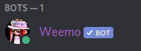

***************************
Häufige Fragen und Probleme
***************************

.. contents:: Inhalte

.. _no_roles:

Weemo verteilt die Rollen nicht
===============================

*Weemo verteilt die Levelrollen/ReactionRoles nicht. Was muss ich tun?*

#. Kontrolliere ob Weemo das Recht *Rollen verwalten* oder *Administrator* hat.
   Gehe dazu zu :ref:`Weemos Berechtigungen<rolleneinstellung>` und
   aktiviere entweder *Rollen verwalten* oder *Administrator*.

#. Gehe in die :ref:`Rolleneinstellung<rolleneinstellung>` und verschiebe Weemos Rolle über die Rollen, die Weemo verteilen soll.
   Weemo kann nur Rollen verteilen, die unter ihrer höchsten Rolle sind.

   .. image:: images/levelrollen.png
      :alt: Weemos Rolle steht ganz oben, darunter befinden sich Levelrollen. Weemos Rolle muss immer über den eingerichteten Rollen stehen, sonst können keine Rollen vergeben werden.

.. _rolleneinstellung:

Wie komme ich in die Rolleneinstellungen?
=========================================

Zuerst in die *Servereinstellungen*, dann zu *Rollen*.
Falls du die Berechtigungen einer Rolle ändern willst, wähle diese Rolle aus und gehe auf *Berechtigungen*.

.. _id:

Wie bekomme ich eine ID und was ist das?
========================================

.. _id_explanation:

Was ist eine ID?
----------------

Eine ID ist eine lange Zahl, die von Discord genutzt wird, um Elemente auseinanderzuhalten.

Zwei Gedankenspiele:

Stell die vor, du schreibst eine Nachricht. Zwei Sekunden später schreibst du versehentlich die
gleiche Nachricht in den selben Kanal. Nun willst du die zweite Nachricht löschen.
Wie kannst du Discord mitteilen, dass du nur die zweite der beiden identischen Nachrichten löschen willst?

Stell dir vor, dein Nutzername ist *Alice#1234*. Nun änderst du ihn zu *Bob#4321*.
Doch dein Server wurde von *Alice#1234* erstellt.
Wie erkennt Discord, dass der Server immer noch dir gehört, obwohl dein Name anders ist?

Darum bekommt jeder Nutzer, jeder Server, jeder Kanal, jedes Emoji, jede Nachricht und eigentlich alles auf Discord eine ID.
Diese ID ist eine 16 bis zwanzigstellige Zahl und sieht zum Beispiel so aus: ``452763583348998155``.
Einmal vergeben, kann diese ID kein zweites mal vorkommen und nicht geändert werden.
Discord arbeitet nur mit IDs, auch wenn sie meist nicht angezeigt werden.

Zwei identische Nachrichten von der gleichen Person haben zwei verschiedene IDs. So kann Discord sie unterscheiden.
Bei deinem Server ist als Owner nicht dein Name, sondern deine ID gespeichert.
Änderst du deinen Nutzernamen, ist das egal, da die ID die gleiche bleibt.

.. _id_how_to_get:

Wie bekomme ich eine ID?
------------------------

Es gibt drei Arten, eine ID herauszufinden:

#. Erwähne den Kanal, den Nutzer oder die Rolle dessen ID du bekommen möchtest.
   Schreibe dann direkt vor die Erwähnung ein Backslash (das ist dieses Zeichen: ``\``)
   Die Nummer, die Discord nach dem Senden der Nachricht anzeigt ist die ID.
   Die Klammern und Sonderzeichen um die Nummer herum sind kein Teil der ID.

   .. warning:: Die Personen und Rollen erhalten trotzdem einen Ping.

#. Schalte den Entwicklermodus von Discord ein.
   Gehe dazu auf *Einstellungen* > *Verhalten* und aktiviere *Entwicklermodus*.
   Wenn du nun einen Nutzer, einen Kanal oder eine Rolle mit der rechten Maustaste anklickst
   (oder auf dem Handy lange gedrückt hältst) kannst du über ``ID kopieren`` die ID kopieren.

   .. note:: Auf dem Handy musst du im Menü ggf. nach unten scrollen, um den Punkt ``ID kopieren`` zu sehen.

#. Nutze die Befehle ``roleinfo``, ``userinfo``, ``channelinfo`` bzw. ``serverinfo``.
   Weemo wird euch auch dort die ID anzeigen.

.. _no_reaction:

Weemo reagiert nicht, was soll ich tun?
=======================================

.. _no_reaction_status:

Weemos Status überprüfen
------------------------

Suche nach Weemo in der Mitglieder-Liste auf der rechten Seite.

**Falls** der Punkt neben Weemos Profilbild grau ist:

- dann ist Weemo offline. Du musst kurz warten, bis Weemo wieder online ist.
- Sollte Weemo länger offline sein, kannst du auf dem `Weemo HQ`_ nachschauen,
  wann Weemo voraussichtlich neu gestartet wird.

**Falls** der Punkt neben Weemos Profilbild grün ist:

- dann ist Weemo online
- Mache weiter mit :ref:`no_reaction_prefix`

**Falls** Weemo nicht in der Liste ist:

- dann kann Weemo den Kanal nicht sehen.
- Ändere die Rechte, so dass Weemo den Kanal sehen kann.

  (*Auf größeren Servern kann es passieren, dass Mitglieder, die offline sind, nicht angezeigt werden.*
  *In diesem Fall musst du Weemos Online-Status über die Mitgliederliste des Servers oder über andere Bots herausfinden.*)

Weemos Berechtigungen überprüfen
--------------------------------

Gehe in die :ref:`Rolleneinstellung<rolleneinstellung>` und überprüfe Weemos Berechtigungen.

- Weemo braucht die Rechte *Kanäle ansehen*, *Nachrichten senden* und *Links einbetten*.
- Alternativ geht auch das Recht *Administrator*.

In privaten Kanälen muss Weemo zusätzlich dem Kanal hinzugefügt werden:

- Am Computer:

  - Gehe in den Kanaleinstellungen auf *Mitglied oder Rolle hinzufügen* (in der Kategorie *Privater Kanal*) und füge Weemo hinzu.

- Am Handy oder über *Erweiterten Berechtigungen*:

  - Gehe in die Kanaleinstellungen.
  - Füge Weemos Rolle hinzu, sofern nicht schon getan.
  - Aktiviere *Kanal zeigen*, *Nachrichten senden* und *Links einbetten*.

.. _no_reaction_failed:

Falls das alles nicht geklappt hat
----------------------------------

- Tritt dem `Weemo HQ`_ bei und frage bei Support nach.

.. _Weemo HQ: https://discord.com/invite/myD9rUF
